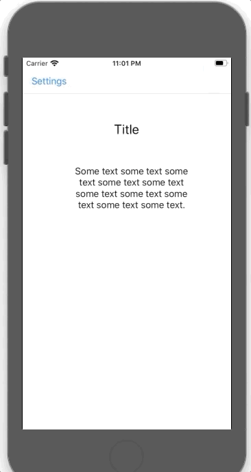

# Example on delegates

Update main view when mode selected from settings menu, using delegates.




## Notes:

* Outside `SettingsSideView`, create custom protocol.


```swift
// Custom protocol
protocol SettingsDelegate{
    func didSelectMode(mode:Int)
}
```

* In `SettingsSideView`:

**1.** Define a variable of type custom protocol.

```swift
 // Define a variable of type custom protocol
    var delegate : SettingsDelegate!
```

**2.** Call the protocol method when a mode is selected.

```swift
 self.delegate?.didSelectMode(mode: sender.tag)
```

* In main view:

**1.** Inherit from custom protocol.

```swift
// Inherit from custom protocol
class ViewController: UIViewController, SettingsDelegate {
  ...
}
```

**2.** Set delegate of `SettingsSideView` to self.

```swift
// set delegate of 'settingsSideview' to self
        settingsSideView.delegate = self
```

**3.** Implement the custom protocol method, in which update the main view based on the selected mode.

```swift
func didSelectMode(mode: Int) {
  ...
}
```
